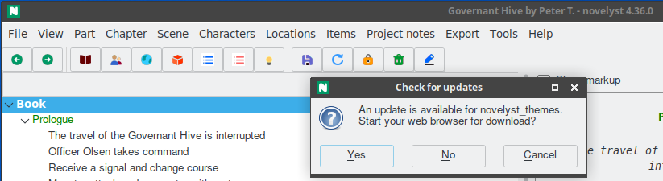

# novelyst_updater

The [novelyst](https://peter88213.github.io/novelyst/) Python program helps authors organize novels.  

*novelyst_updater* is a plugin providing an update ckecker fpr the *novelyst* program and the installed plugins. 

## Requirements

- [novelyst](https://peter88213.github.io/novelyst/) version 4.36+

## Download and install

[Download the latest release (version 0.2.2)](https://github.com/peter88213/novelyst_updater/raw/main/dist/novelyst_updater_v0.2.2.zip)

- Extract the "novelyst_updater_v0.2.2" folder from the downloaded zipfile "novelyst_updater_v0.2.2.zip".
- Move into this new folder and launch **setup.pyw**. This installs the plugin for the local user.

---

[Changelog](changelog)

## Usage

See the [instructions for use](usage)

---

## License

This is Open Source software, and the *novelyst_updater* plugin is licensed under GPLv3. See the
[GNU General Public License website](https://www.gnu.org/licenses/gpl-3.0.en.html) for more
details, or consult the [LICENSE](https://github.com/peter88213/novelyst_updater/blob/main/LICENSE) file.
